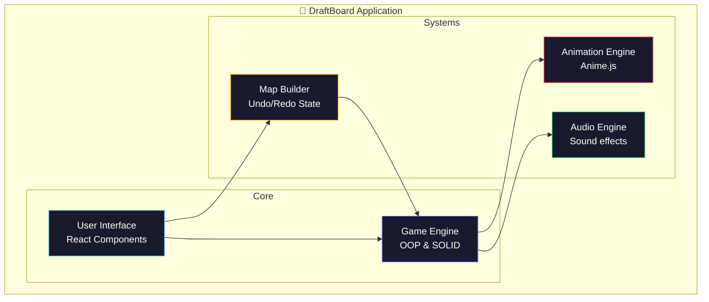

# DraftBoard Builder

<div align="center">


[](https://www.typescriptlang.org/)
[](https://vitejs.dev/)
[](https://react.dev/)
[](https://tailwindcss.com/)
[](LICENSE)

</div>

---

> 🎯 **Build your own adventures.** DraftBoard Builder is a dynamic, customizable mini board game engine and map builder, allowing you to design tracks, set rules, and play right in the browser.

---

## ✨ What It Does

DraftBoard is organized around a dual experience: **Building** and **Playing**.

```
DESIGN MAP  →  SET RULES  →  PLAY GAME  →  SHARE
```

| Zone | Features |
|---|---|
| 🗺️ **Map Builder** | Draw paths, place special tiles, configure "Exact Landing" rules, full Undo/Redo state management. |
| 🎲 **Play Mode** | Roll dice, move tokens with Anime.js smooth animations, trigger tile events (Duel, Dungeon, etc.). |
| 🛠️ **System** | Built strictly on Clean Code, SOLID, and OOP principles for robust, scalable architecture. |

---

## 🛠️ Tech Stack

### Frontend Showcase
-  **Core UI** — React components, Tailwind CSS styling
-  **Language** — Strict TypeScript for absolute type safety
-  **Animations** — Robust token movement and dice rolling animations
-  **State Management** — Global state for Map Builder Undo/Redo and Game Engine

### Tooling & Environment
- **Vite** — Lightning fast build tool and dev server
- **ESLint & Prettier** — Strict code formatting and linting rules

---

## 🏗️ Architecture



---

## 📖 Documentation

All architecture docs, feature plans, and agent protocols live in [`docs/`](docs/).

**→ Start with [`docs/architecture.md`](docs/architecture.md)**

---

## 🚀 Getting Started

### Prerequisites

- **Node.js** ≥ 20
- **npm** or **pnpm** or **yarn**

### Installation

```bash
# Clone the repo
git clone https://github.com/your-org/draftboard-builder.git
cd draftboard-builder

# Install all dependencies
npm install

# Start in dev mode
npm run dev
```

Open `http://localhost:5173` to see the app.

### Useful Scripts

| Command | Description |
|---|---|
| `npm run dev` | Start development server |
| `npm run build` | Production build |
| `npm run preview` | Preview production build |
| `npm run lint` | Run ESLint |

## 📄 License

See [LICENSE](LICENSE) for details.

---

<div align="center">

Built by NirussVn0. ✦ 2026

</div>
